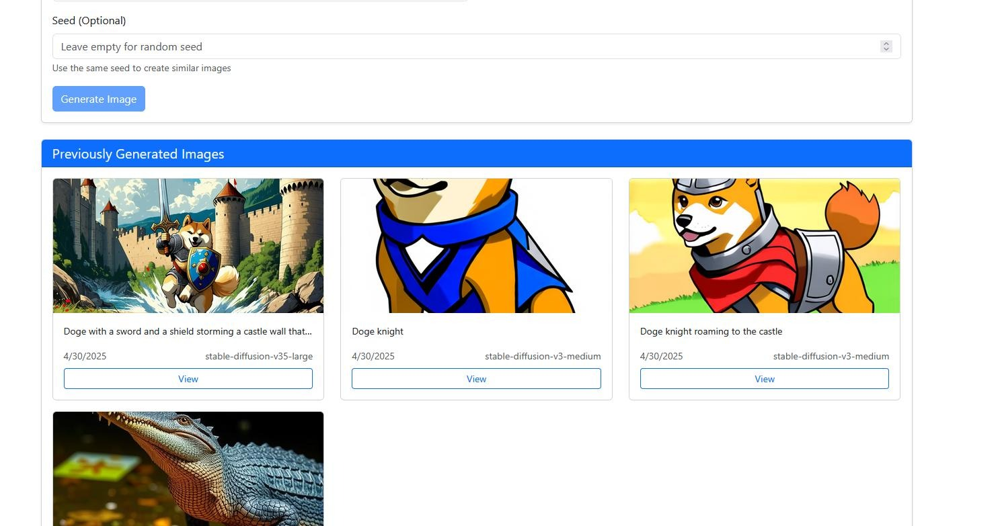

# AI/ML API WEB UI

This is a [Next.js](https://nextjs.org) chat application that connects to AI APIs like OpenAI.

## Features

- Connect to AI APIs (like OpenAI) for chat functionality
- Fetch and use models directly from the API
- Store configuration and API settings in a SQLite database
- Secure storage of API keys using encryption
- SearxNG integration for enhanced search capabilities
- Search engine selection for SearxNG (Google, Bing, DuckDuckGo, etc.)
- Deep thinking mode for more thoughtful responses
- Chat history storage in the database
- NEW CHAT functionality to start fresh conversations

## Showcase

Here are some screenshots of the application in action:


*Main chat interface with AI responses*


*Image generation*


*Past generated images*


*3d Model section*

## Getting Started

First, install the dependencies:

```bash
npm install
```

Then, run the development server:

```bash
npm run dev
```

Open [http://localhost:3000](http://localhost:3000) with your browser to see the result.

## Configuration

### API Settings

1. Enter your API URL (e.g., https://api.aimlapi.com (supported fully), https://api.openai.com)
2. Enter your API Key
3. Click "Save API Settings" to store them securely in the database

### SearxNG Settings

1. Enter your SearxNG domain (e.g., https://your.searxng.instance)
2. Select your preferred search engine (Google, Bing, DuckDuckGo, etc.)
3. Enable SearxNG integration using the checkbox in the Chat section
4. Click "Update Config" to save your settings

### Models

The application will fetch available models from the API. You can:
- Select a model from the dropdown
- Click "Refresh (GET)" to load models from the database
- Click "Refresh (POST)" to fetch fresh models from the API

### Chat

Enter your message and click "Send" to chat with the AI. The application will:
1. Use your selected model
2. Connect to the API using your stored credentials
3. If SearxNG is enabled, perform a web search and include relevant results
4. If Deep Thinking is enabled, instruct the AI to provide more thorough analysis
5. Display the AI's response
6. Store the conversation in the database for future reference

You can start a new conversation at any time by clicking the "New Chat" button.

## Technical Details

### Database

The application uses SQLite to store:
- Configuration settings
- API credentials (encrypted)
- Available models
- Chat sessions and message history

### Security

API keys are encrypted using AES encryption before being stored in the database.

### API Integration

The application is designed to work with OpenAI-compatible APIs, using endpoints like:
- `/v1/models` to fetch available models
- `/v1/chat/completions` for chat functionality

## Learn More

To learn more about Next.js, take a look at the following resources:

- [Next.js Documentation](https://nextjs.org/docs) - learn about Next.js features and API.
- [Learn Next.js](https://nextjs.org/learn) - an interactive Next.js tutorial.


# Setting up SearXNG and API for AIMLAPI

## IMPORTANT
Set environment variable .env

    ENCRYPTION_KEY='YOUR SECRET ENCRYPTION KEY'


This will make sure your api key stored will be encrypted which is a requirement for this app to work

## Searxng
The easiest way to set up https://docs.searxng.org/admin/installation-docker.html
after you run this, you must edit the settings and allow json and other types of output in the settings folder that gets created
then stop the container and re-run.

## AIMLAPI
For better documentation check AI ML API Docs https://docs.aimlapi.com/quickstart/setting-up

### Set API URL
    https://api.aimlapi.com

### Generate an API KEY and use it
It is pretty straightforward process to get your API KEY on the web site, no need to explain
